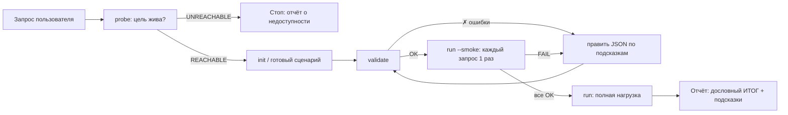

# load-agent — ИИ-агент нагрузочного тестирования REST API

Универсальный (не привязанный к DLMM) инструмент + промпт агента, чтобы любой член команды
мог сказать ИИ-ассистенту «прогони нагрузочный тест на сервис X» и получить честный отчёт.

**Ключевая идея: думает инструмент, а не модель.** Агент рассчитан на слабые модели
(Haiku, GigaChat, локальные 7-14B): вся математика, валидация конфига, вердикт PASS/FAIL и
диагностика зашиты в детерминированный CLI без зависимостей. Модели остаётся выполнить
6 шагов конвейера и дословно пересказать блок «ИТОГ».

## Состав

```
load-agent/
├── bin/loadgen.mjs          # CLI-генератор нагрузки (Node >= 18, ноль зависимостей)
├── scenarios/               # готовые сценарии (*.json)
│   └── dlmm-read-heavy.json # демо: read-heavy браузинг DLMM через gateway :8080
├── agent/
│   ├── SYSTEM_PROMPT_BODY.md# переносимый промпт агента (для любого харнесса)
│   └── README.md            # как подключить к GigaChat/другому LLM
└── results/                 # сюда пишутся JSON-результаты прогонов

.claude/agents/load-tester.md   # готовый субагент для Claude Code (model: haiku)
.claude/skills/load-test/       # скилл-обёртка: /load-test
```

## Быстрый старт (руками, без ИИ)

```bash
node load-agent/bin/loadgen.mjs probe http://localhost:8080 actuator/health api/v1/pools
node load-agent/bin/loadgen.mjs init --out my.json     # шаблон с подсказками
node load-agent/bin/loadgen.mjs validate my.json       # точные ошибки, если что-то не так
node load-agent/bin/loadgen.mjs run my.json --smoke    # каждый запрос по 1 разу (проверка конфига)
node load-agent/bin/loadgen.mjs run my.json            # нагрузка + вердикт PASS/FAIL
```

В Claude Code: `/load-test http://localhost:8080 ...` или попросить текстом
«прогони нагрузочный тест...» — сработает субагент `load-tester`.

## Конвейер агента



## Сценарий: справочник полей

```jsonc
{
  "name": "my-test",
  "baseUrl": "http://localhost:8080",     // только схема://хост:порт
  "timeoutMs": 10000,
  "headers": {},                           // общие заголовки
  "auth": {
    "type": "login",                       // none | bearer | login
    "token": "...",                        // для bearer
    "login": {                             // для login: логин выполняется на каждого VU
      "path": "/api/v1/auth/login",
      "method": "POST",
      "body": { "email": "...", "password": "..." },
      "tokenField": "accessToken"          // dot-путь до JWT в ответе, напр. "data.token"
    }
  },
  "vars": {                                // переменные для {{placeholder}}
    "poolId": { "setupPath": "/api/v1/pools?size=20", "extract": "content[*].id" },
    "page":   [0, 1, 2]                    // или статический список
  },
  "requests": [                            // weight = относительная частота
    { "name": "list",   "method": "GET", "path": "/api/v1/pools?page={{page}}", "weight": 5 },
    { "name": "detail", "method": "GET", "path": "/api/v1/pools/{{poolId}}",    "weight": 3 }
  ],
  "load": {
    "vus": 10,                             // виртуальные пользователи (max 200)
    "durationSec": 60,                     // max 900
    "rampUpSec": 5,                        // плавный старт VU
    "thinkTimeMs": [50, 200],              // пауза между запросами VU
    "maxRps": 50                           // глобальный потолок (опционально)
  },
  "thresholds": { "p95Ms": 500, "errorRatePct": 1 },  // критерии PASS/FAIL
  "allowWrites": false                     // true + флаг --allow-writes для POST/PUT/DELETE
}
```

Встроенные placeholders: `{{uuid}}`, `{{ts}}`, `{{randInt:1-100}}`.
Extract-пути: `content[*].id` (Spring Page), `[*].id` (массив), `data.items[0].id`.

## Что умеет отчёт

- перцентили p50/p90/p95/p99/max по каждому запросу и суммарно (латентность считается
  до последнего байта тела ответа, только по успешным);
- распределение статусов, классификация ошибок (timeout / conn / 4xx / 5xx) с примерами тел;
- детект деградации (p95 второй половины прогона >> первой);
- проверка порогов → `VERDICT: PASS|FAIL` и коды выхода: 0 PASS, 1 ошибка конфига,
  2 FAIL, 3 цель недоступна;
- рекомендации («это rate limit — задайте maxRps», «система держит — повышайте --vus»);
- машиночитаемый JSON (`--out file.json`).

## Предохранители (важно для командного использования)

1. **Запись** — двойное подтверждение: `allowWrites: true` в сценарии **и** флаг `--allow-writes`.
2. **Внешние хосты** — нагрузка только на localhost/приватные сети; для своего внешнего
   стенда нужен явный флаг `--confirm-external`. Нагружать чужие системы недопустимо.
3. **Жёсткие лимиты**: vus ≤ 200, duration ≤ 900с — в коде, обойти флагом нельзя.
4. Смоук перед нагрузкой — агент обязан прогнать `--smoke` до полного запуска.

## Почему это работает на слабых моделях

| Обычный подход | Здесь |
|---|---|
| модель пишет скрипт нагрузки | скрипт уже написан и оттестирован |
| модель считает перцентили/RPS | считает CLI, модель копирует блок «ИТОГ» |
| модель интерпретирует сырые ошибки | CLI печатает готовые «ПОДСКАЗКИ» |
| модель решает, валиден ли конфиг | `validate` печатает точные «✗ ...» с инструкцией |
| свободный формат отчёта | промпт фиксирует: скопируй ИТОГ → таблицу → подсказки |

Известная особенность демо-стенда DLMM: на gateway включён rate limit (~10 rps на ключ в
текущем образе), поэтому в `dlmm-read-heavy.json` стоит `maxRps: 8`. Уберите его, если хотите
увидеть, как инструмент репортит 429 и находит предел пропускной способности.
