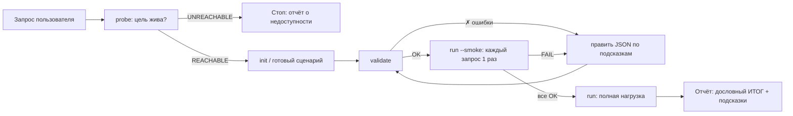

# load-agent — ИИ-агент нагрузочного тестирования REST API

Универсальный (не привязанный к DLMM) инструмент + промпт агента, чтобы любой член команды
мог сказать ИИ-ассистенту «прогони нагрузочный тест на сервис X» и получить честный отчёт.

**Ключевая идея: думает инструмент, а не модель.** Агент рассчитан на слабые модели
(Haiku, GigaChat, локальные 7-14B): вся математика, валидация конфига, вердикт PASS/FAIL и
диагностика зашиты в детерминированный CLI без зависимостей. Модели остаётся выполнить
6 шагов конвейера и дословно пересказать блок «ИТОГ».

## Состав

```
load-agent/
├── bin/loadgen.mjs          # CLI-генератор нагрузки (Node >= 18, ноль зависимостей)
├── scenarios/               # готовые сценарии (*.json)
│   ├── dlmm-read-heavy.json # демо: read-heavy браузинг DLMM через gateway :8080
│   └── dlmm-journey.json    # демо: сценарий-цепочка (list→open→bins) с capture
├── clients/                 # обёртки для интеграции в тесты: Node/Python/Java/Scala
├── test/                    # регрессионные self-тесты ядра (node --test)
├── agent/
│   ├── SYSTEM_PROMPT_BODY.md   # переносимый промпт агента (для любого харнесса)
│   ├── REQUEST_ANALYSIS.md     # развёрнутый промпт разбора запроса пользователя → сценарий
│   ├── PROFILE_FROM_STATS.md   # промпт: профиль нагрузки из access-лога/метрик
│   └── README.md               # как подключить к GigaChat/другому LLM
└── results/                 # сюда пишутся JSON-результаты прогонов

.claude/agents/load-tester.md   # готовый субагент для Claude Code (model: haiku)
.claude/skills/load-test/       # скилл-обёртка: /load-test
```

## Быстрый старт (руками, без ИИ)

```bash
node load-agent/bin/loadgen.mjs probe http://localhost:8080 actuator/health api/v1/pools
node load-agent/bin/loadgen.mjs init --out my.json          # шаблон с подсказками
node load-agent/bin/loadgen.mjs validate my.json            # точные ошибки, если что-то не так
node load-agent/bin/loadgen.mjs run my.json --smoke         # каждый запрос по 1 разу (проверка конфига)
node load-agent/bin/loadgen.mjs run my.json                 # нагрузка + вердикт PASS/FAIL
node load-agent/bin/loadgen.mjs run my.json --workers 4     # та же нагрузка на 4 ядрах
node load-agent/bin/loadgen.mjs run my.json --baseline base.json  # + сравнить с эталоном (регресс → exit 2)
node load-agent/bin/loadgen.mjs compare base.json cur.json  # сравнить два прогона
node load-agent/bin/loadgen.mjs profile access.log --base-url http://x  # черновик сценария из лога
```

В Claude Code: `/load-test http://localhost:8080 ...` или попросить текстом
«прогони нагрузочный тест...» — сработает субагент `load-tester`.

## Конвейер агента



## Сценарий: справочник полей

```jsonc
{
  "name": "my-test",
  "baseUrl": "http://localhost:8080",     // только схема://хост:порт
  "timeoutMs": 10000,
  "headers": {},                           // общие заголовки
  "auth": {
    "type": "login",                       // none | bearer | login
    "token": "...",                        // для bearer
    "login": {                             // для login: логин выполняется на каждого VU
      "path": "/api/v1/auth/login",
      "method": "POST",
      "body": { "email": "...", "password": "..." },
      "tokenField": "accessToken"          // dot-путь до JWT в ответе, напр. "data.token"
    }
  },
  "vars": {                                // переменные для {{placeholder}} — 4 источника:
    "poolId": { "setupPath": "/api/v1/pools?size=20", "extract": "content[*].id" }, // с сервера
    "page":   [0, 1, 2],                                          // статический список
    "userId": { "file": "data/user-ids.txt" },                    // файл: .txt построчно (# — комментарий)
    "email":  { "file": "data/users.csv", "column": "email" }     // .csv по колонке; .json — с "extract"
  },
  "requests": [                            // weight = относительная частота
    { "name": "list",   "method": "GET", "path": "/api/v1/pools?page={{page}}", "weight": 5,
      "checks": {                          // валидация ответов (все ключи опциональны)
        "status": [200],                   //   допустимые коды (иначе 2xx-3xx)
        "notEmpty": true,                  //   тело не пустое
        "bodyContains": "content",         //   подстрока в теле
        "jsonPath": "content[*].id",       //   путь обязан дать значения
        "jsonPathEquals": { "path": "pageable.pageNumber", "value": 0 },
        "maxMs": 300                       //   бюджет времени (не ломает вердикт, но виден в отчёте)
      }
    },
    { "name": "detail", "method": "GET", "path": "/api/v1/pools/{{poolId}}",    "weight": 3 }
  ],
  "load": {
    "vus": 10,                             // виртуальные пользователи (max 200)
    "durationSec": 60,                     // max 900
    "rampUpSec": 5,                        // плавный старт VU
    "thinkTimeMs": [50, 200],              // пауза между запросами VU
    "maxRps": 50,                          // глобальный потолок (опционально)
    "workers": 1                           // потоков-генераторов на разные ядра (см. «Параллелизм»)
  },
  "thresholds": { "p95Ms": 500, "errorRatePct": 1 },  // критерии PASS/FAIL
  "allowWrites": false                     // true + флаг --allow-writes для POST/PUT/DELETE
}
```

Встроенные placeholders: `{{uuid}}`, `{{ts}}`, `{{randInt:1-100}}`.
Extract-пути: `content[*].id` (Spring Page), `[*].id` (массив), `data.items[0].id`.
Пути файлов в `vars.file` — относительно папки сценария. Провал контентной проверки
(`notEmpty`/`bodyContains`/`jsonPath`/`jsonPathEquals`) считается ошибкой вида `check`
(сервер ответил 2xx, но содержимое неверное) и попадает в errorRatePct.

Семантика, о которой стоит знать:
- внутри одного HTTP-вызова каждый `{{var}}` выбирается ОДИН раз — повторные вхождения
  (например, в path и в body) получают то же значение, и именно оно попадает в разбивку
  «ВЛИЯНИЕ ПАРАМЕТРОВ»;
- `jsonPathEquals` с `[*]`-путём требует совпадения ВСЕХ значений (и хотя бы одного);
  `value` — только скаляр;
- имена запросов должны быть уникальны (метрики агрегируются по имени) — validate следит;
- CSV разбирается по RFC 4180 (кавычки, запятые и переводы строк в полях), UTF-8 BOM
  в файлах срезается автоматически.

## Что умеет отчёт

- перцентили p50/p90/p95/p99/max по каждому запросу и суммарно (латентность считается
  до последнего байта тела ответа, только по успешным);
- распределение статусов, классификация ошибок (timeout / conn / 4xx / 5xx / check)
  с примерами тел;
- секция «ПРОВЕРКИ ОТВЕТОВ»: сколько раз провалилась каждая валидация, сколько ответов
  вышло за бюджет maxMs, пример провала;
- секция «ВЛИЯНИЕ ПАРАМЕТРОВ (списки)»: если запрос параметризован списком ({{var}}),
  метрики считаются по каждому значению — диапазон p95 (min/медиана/max), топ медленных
  значений, выбросы по скорости (p95 > 2× медианы) и по ошибкам (err% ≥ 10). Отдельно
  распознаётся случай «падают все значения» → причина в запросе, а не в данных;
- детект деградации (p95 второй половины прогона >> первой);
- проверка порогов → `VERDICT: PASS|FAIL` и коды выхода: 0 PASS, 1 ошибка конфига,
  2 FAIL, 3 цель недоступна;
- рекомендации («это rate limit — задайте maxRps», «система держит — повышайте --vus»,
  «значение X аномально медленное»);
- машиночитаемый JSON (`--out file.json`): поля checksSummary, paramImpact, hints и т.д.

## Сценарии-цепочки (flows / user journeys)

`requests` — независимая **смесь** (VU дёргает запросы случайно по весам). Для транзакционных
путей, где шаги идут по порядку и связаны данными, есть `flows` — упорядоченные **цепочки**:

```jsonc
"flows": [{
  "name": "add-liquidity",
  "weight": 3,                              // как часто VU выбирает эту цепочку
  "steps": [
    { "name": "list pools", "method": "GET", "path": "/api/v1/pools?size=20",
      "checks": { "jsonPath": "content[*].id" },
      "capture": { "poolId": "content[0].id", "bin": "content[0].activeBinId" } },
    { "name": "open pool", "method": "GET", "path": "/api/v1/pools/{{poolId}}" },
    { "name": "add liquidity", "method": "POST", "path": "/api/v1/positions",
      "body": { "poolId": "{{poolId}}", "binId": "{{bin}}", "amount": "100" } }
  ]
}]
```

- Каждый VU проходит `steps` **по порядку** как одну сессию, затем повторяет.
- `capture: { "имя": "json.путь" }` извлекает значение из ответа шага в `{{имя}}` для
  **следующих** шагов (session-scope). Захваченное недоступно текущему и прошлым шагам —
  валидатор это проверяет.
- Если шаг падает (статус/проверка/захват) — остальные шаги сессии пропускаются.
- Отчёт добавляет секцию **«СЦЕНАРИИ-ЦЕПОЧКИ»**: % сессий, дошедших до конца, p50/p95
  суммарного времени ответов journey (только латентность цели — без rate-gate пауз и
  think-time) и **шаг, на котором чаще всего рвётся** (узкое место сценария).
- `requests` и `flows` можно задавать вместе (фоновая смесь + журналы). Обратная
  совместимость полная: сценарий только с `requests` работает как раньше.
- Один прогон `--smoke` проходит каждую цепочку целиком один раз — проверяет всю проводку
  (включая capture) до нагрузки.

## Многоступенчатый профиль (`load.stages`) — ramp / spike / soak

Постоянная нагрузка (`vus` + `durationSec`) не находит точку излома. Для этого — ступени:

```jsonc
"load": {
  "stages": [
    { "vus": 50,  "durationSec": 30 },   // разгон 0 → 50 за 30с
    { "vus": 200, "durationSec": 60 },   // разгон 50 → 200 за 60с (ищем предел)
    { "vus": 200, "durationSec": 120 },  // плато на 200 (soak — утечки/деградация)
    { "vus": 0,   "durationSec": 30 }    // плавный спад
  ],
  "thinkTimeMs": [50, 200]
}
```

- Число активных VU интерполируется линейно между уровнями (старт с 0). Пик выводит `vus`,
  сумма длительностей — общую продолжительность (`stages` заменяет `vus`/`durationSec`).
- Прогресс каждые 5с показывает текущий целевой уровень `цель=NVU`.
- Работает в многопотоке (все потоки делят один график по времени старта).
- При stages детект «деградации во времени» отключается (рост латентности к концу —
  следствие роста нагрузки, а не утечки); смотрите на форму RPS/латентности по ходу.

## Метрики цели: генератор или сервис — кто узкое место (`monitor`)

Секция «РЕСУРСЫ ГЕНЕРАТОРА» отвечает «упёрлись ли МЫ». Блок `monitor` добавляет вторую половину —
метрики **самой цели** во время прогона, чтобы отличить «медленно из-за генератора» от
«медленно из-за сервиса»:

```jsonc
"monitor": {
  "intervalSec": 5,
  "docker": { "containers": ["dlmm-pool-engine", "dlmm-gateway"] },   // через `docker stats`
  "prometheus": {                                                     // или/и через Prometheus
    "url": "http://localhost:9090",
    "queries": {
      "pool-engine CPU %": "rate(process_cpu_seconds_total{instance=\"dlmm-pool-engine:8080\"}[1m])*100",
      "heap used МБ": "sum(jvm_memory_used_bytes{area=\"heap\"})/1048576"
    }
  },
  "thresholds": { "dlmm-pool-engine CPU %": { "max": 85 } }           // опц. — войдёт в вердикт
}
```

- **docker** — `docker stats` по контейнерам (CPU %, память), без PromQL, для любой docker-цели.
- **prometheus** — произвольные PromQL-запросы (агрегируйте до одного значения через `sum()/avg()`).
- Отчёт: секция «МЕТРИКИ ЦЕЛИ» с min/avg/max/пиком/последним по каждой метрике.
- **Корреляция**: если CPU цели дошёл до насыщения, а генератор — нет, инструмент прямо пишет
  «⚠ ЦЕЛЬ упёрлась — предел в самом сервисе». Если ни то, ни другое, а латентность высокая —
  подсказывает искать вне CPU (БД, блокировки, GC, внешний сервис).
- `monitor.thresholds` (опц.) — порог по метрике цели (например «CPU < 85%») входит в вердикт.

## Параллелизм и ресурсы генератора

`load.workers` (или `--workers N`) распределяет VU по нескольким потокам `worker_threads`,
каждый на своём ядре — это снимает потолок «одно ядро Node» при высоких RPS. Статистика
всех потоков сливается в один отчёт. Разумный предел — число ядер машины.

Отчёт **всегда** содержит секцию «РЕСУРСЫ ГЕНЕРАТОРА»: CPU процесса (в % от одного ядра и от
всех), event-loop lag, память процесса и системы. Если генератор упёрся (CPU ≥ 85% всех ядер,
event-loop lag > 100мс или мало свободной ОЗУ) — инструмент прямо пишет **«⚠ УПЁРЛИСЬ»** и
предупреждает, что латентность и достигнутый RPS ограничены самой машиной-генератором, а не
целью. В подсказках: либо «добавьте workers» (если ядра ещё свободны), либо «нужно более мощное
железо / несколько машин» (если все ядра уже заняты). Это защищает от вывода «сервис медленный»,
когда на самом деле медленный генератор.

## Профиль нагрузки из статистики (`profile`)

Если есть историческая статистика обращений — превратите её в реалистичный сценарий:

```bash
node load-agent/bin/loadgen.mjs profile access.log --base-url http://host --top 20 --out scenario.json
```

Вход: access-лог (nginx/gateway), CSV (`path,method,count`) или JSON (`[{method,path,count}]` /
`{"GET /x": 1994}`) — формат определяется автоматически. Команда:
- нормализует пути: ID-сегменты (числа, UUID, длинные hex) → `{{переменные}}`, а реальные
  значения из статистики складывает в `vars` (нагрузка идёт по настоящим ID);
- считает `weight` каждого запроса как долю хитов — смесь повторяет продовую;
- из таймстемпов access-лога оценивает средний RPS → `load.maxRps`;
- по умолчанию отбрасывает POST/PUT/DELETE (нужен `--include-writes`).

Результат — **черновик**: впишите `baseUrl`/`auth`, при желании `workers`, затем обычный
`validate → run --smoke → run`. Подробный разбор для агента — `agent/PROFILE_FROM_STATS.md`.

## Интеграция в код (Node.js / Python / Java / Scala)

Готовые обёртки в [clients/](clients/README.md): движок один, клиенты запускают его
процессом и отдают результат в родном виде — удобно для нагрузочных тестов в CI
(pytest / JUnit / scalatest / node:test). Единственное требование на агенте CI — Node >= 18.

## Регрессии: сравнение прогонов (`compare`) — CI-гейт

Один прогон — снимок. Чтобы ловить «этот PR ухудшил p95», сравнивайте текущий результат
с эталонным:

```bash
node load-agent/bin/loadgen.mjs compare baseline.json current.json
# или сразу после прогона:
node load-agent/bin/loadgen.mjs run scenario.json --out current.json --baseline baseline.json
```

- Сравнивает p95/p99/долю ошибок/RPS суммарно **и по каждому запросу**, плюс завершаемость
  цепочек. Локальный регресс одного эндпоинта не спрячется за хорошим средним.
- Пороги: рост p95 > `--max-p95-regression-pct` (по умолч. 20%, с полом шума 5ms) или рост
  ошибок > `--max-error-increase-pp` (по умолч. 1 пункт) → **VERDICT: REGRESSED, exit 2**.
- Заметное улучшение → `IMPROVED`, иначе `STABLE` (оба exit 0).

**Паттерн для CI**: храните `baseline.json` (эталон с main), в пайплайне запускайте
`run ... --baseline baseline.json` — ненулевой код выхода валит сборку при регрессе.
Периодически обновляйте базу принятым прогоном.

### Отчёты для CI: JUnit XML и Markdown

```bash
node load-agent/bin/loadgen.mjs run scenario.json --junit report.xml --md report.md
```
- `--junit` — стандартный JUnit XML: каждый порог/запрос/цепочка становится test-case'ом,
  который Jenkins/GitLab/GitHub Actions рендерят как обычные результаты тестов (провал порога =
  failing test). `--md` — Markdown-сводка для комментария в PR (вердикт, таблица, цепочки, ресурсы).

### Пороги на конкретный запрос (SLO по эндпоинту)

Глобальные `thresholds.p95Ms`/`errorRatePct` дополняются порогами на отдельный запрос:
```jsonc
"thresholds": {
  "p95Ms": 1000, "errorRatePct": 1,
  "perRequest": {
    "pools list":  { "p95Ms": 100 },
    "pool detail": { "p95Ms": 300, "errorRatePct": 0 }
  }
}
```
Нарушение per-request порога тоже валит вердикт (и виден отдельным test-case'ом в JUnit).

### Разогрев (`load.warmupSec`)

`"load": { ..., "warmupSec": 10 }` — первые 10 секунд (JIT, прогрев пула соединений, кэшей)
**не учитываются** в метриках. Перцентили считаются по установившемуся режиму; RPS — по окну
после разогрева. С `stages` не применяется (нагрузка не постоянна).

## Тесты самого движка

Регрессионные self-тесты ядра (парсинг, проверки, захват, валидация flows, слияние
статистики) — в [test/](test/): `cd load-agent && node --test`. Зависимостей нет.

## Предохранители (важно для командного использования)

1. **Запись** — двойное подтверждение: `allowWrites: true` в сценарии **и** флаг `--allow-writes`.
2. **Внешние хосты** — нагрузка только на localhost/приватные сети; для своего внешнего
   стенда нужен явный флаг `--confirm-external`. Нагружать чужие системы недопустимо.
3. **Жёсткие лимиты**: vus ≤ 200, duration ≤ 900с — в коде, обойти флагом нельзя.
4. Смоук перед нагрузкой — агент обязан прогнать `--smoke` до полного запуска.

## Почему это работает на слабых моделях

| Обычный подход | Здесь |
|---|---|
| модель пишет скрипт нагрузки | скрипт уже написан и оттестирован |
| модель считает перцентили/RPS | считает CLI, модель копирует блок «ИТОГ» |
| модель интерпретирует сырые ошибки | CLI печатает готовые «ПОДСКАЗКИ» |
| модель решает, валиден ли конфиг | `validate` печатает точные «✗ ...» с инструкцией |
| свободный формат отчёта | промпт фиксирует: скопируй ИТОГ → таблицу → подсказки |

Известная особенность демо-стенда DLMM: на gateway включён rate limit (~10 rps на ключ в
текущем образе), поэтому в `dlmm-read-heavy.json` стоит `maxRps: 8`. Уберите его, если хотите
увидеть, как инструмент репортит 429 и находит предел пропускной способности.
